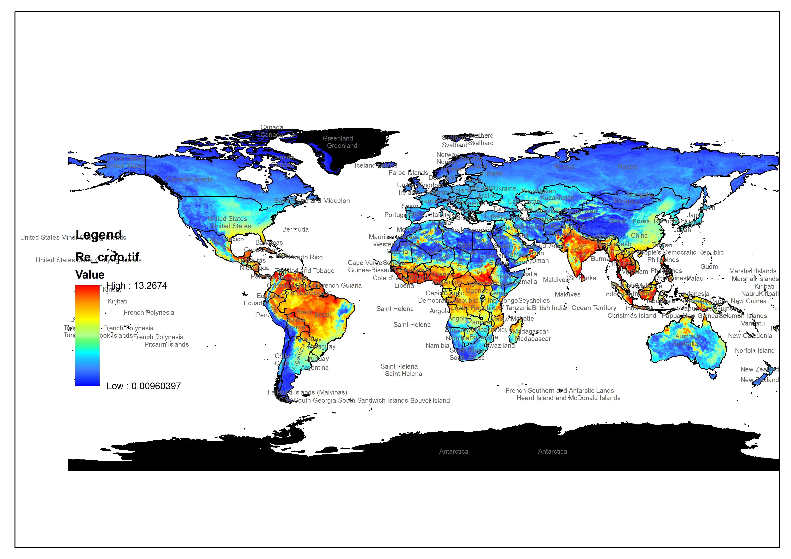

## ICBM climatic modifier module##
ICBM is the Introductory Carbon Balance Model, a relatively minimalistic soil organic carbon decay model. The model is a compartmental decay model with two pools in its original formulation, and it has been modified and used in a number of publications.
The model relies on two decay kinetics for each soil organic carbon pool over time, and each of these can be modified linearly by a scaling term determined by climate (specifically soil temperature and moisture). The #rclim# module calculates this scaling from climatic data (please refer to the package documentation and publications for more details). The tool can be useful directly in ICBM, but also to given an idea of the effect of soil moisture and temperature on decomposition of organic matter.
You can access the package from my GitHub: [https://github.com/ilmenichetti/reclim](https://github.com/ilmenichetti/reclim)

One example of the rclim normalization factor (here calculated based on remote sensed moisture data and global average temperatures):
